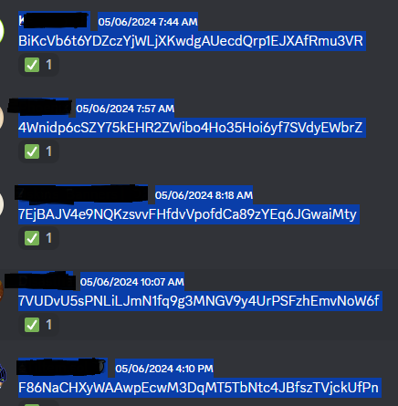

## About

- get_wallets_discord_channel.py :
   
        Select like in image, then copy it into "text.txt" and run script
   
        
 

- get_discord_reactions_&_create_channel.py :
 
        1) Set target_channel_id to the private channel id
         
        2) Get ✅ reactions from discord message using /reactions <message_link> and bot responds mentioning everyone that reacted (Should be used in private chat)
         
        3) Use /create_channel <category_id> <Channel_name> <message_link> where the message_link is the link for the message the bot responded with the mentiones users
           
        4) Bot will then create the channel and give access to everyone that reacted to the first message
